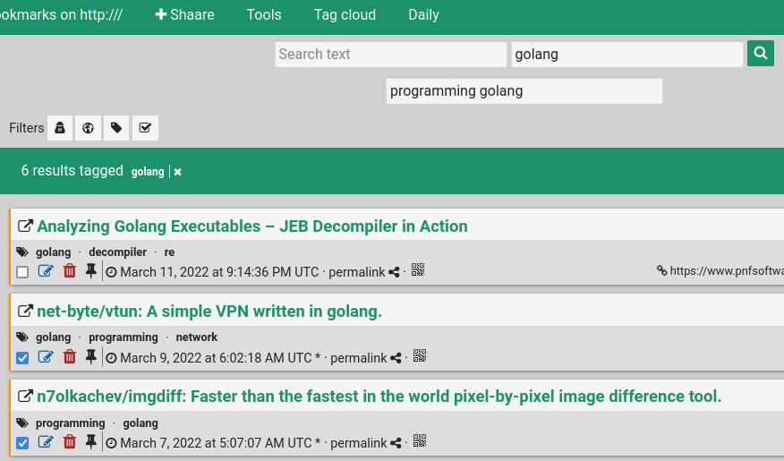
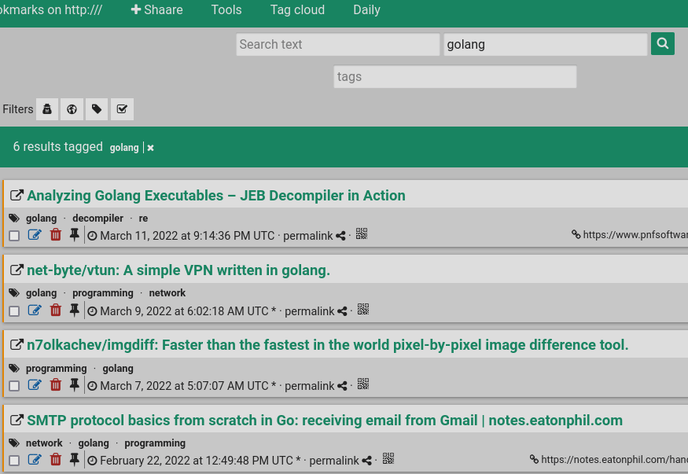
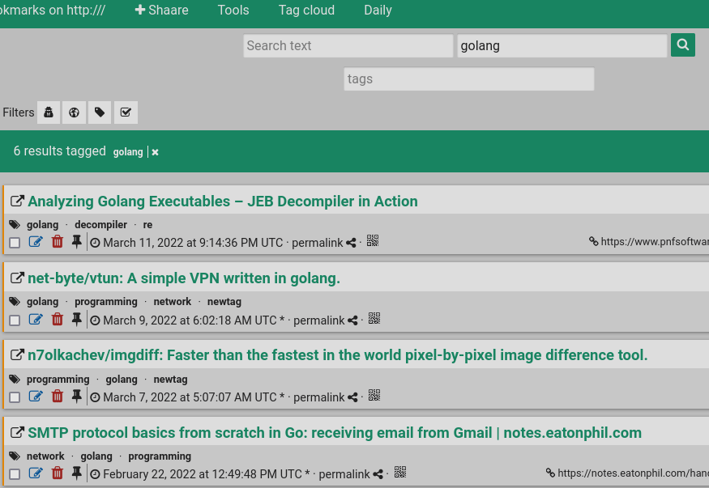

# shaarli-bulktagops

This is a Shaarli plugin that enables adding/removing common tags in selected
links.

The development is in early stages so use at your own risk.

## Installation

Clone this repository under `/var/www/shaarli/plugins`.

## Config

This plugin uses the REST api to update link metadata, so it requires the api
key in order to work.

## Usage

Once you start selecting links, the plugin will automatically update the bar,
showing intersection of tags.

It's possible to add new tags (existing tags can easily be accessed with
autocomplete) by just editing the bar and hitting enter (then refreshing the
page for now :).

Tags can be removed by placing a minus prefix ('-'):

